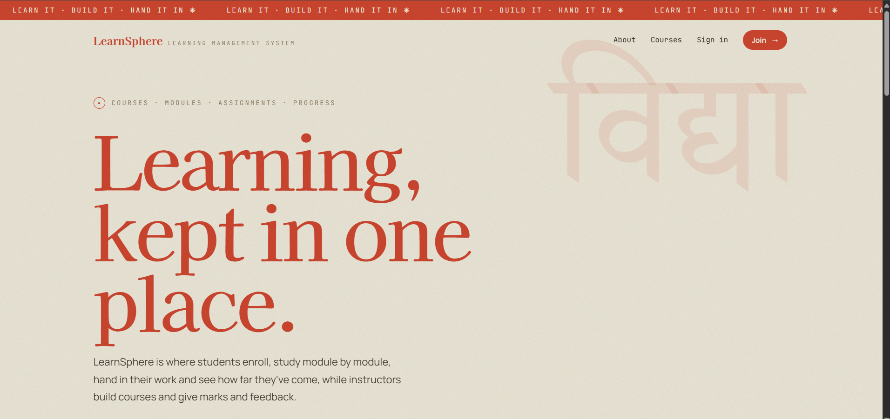
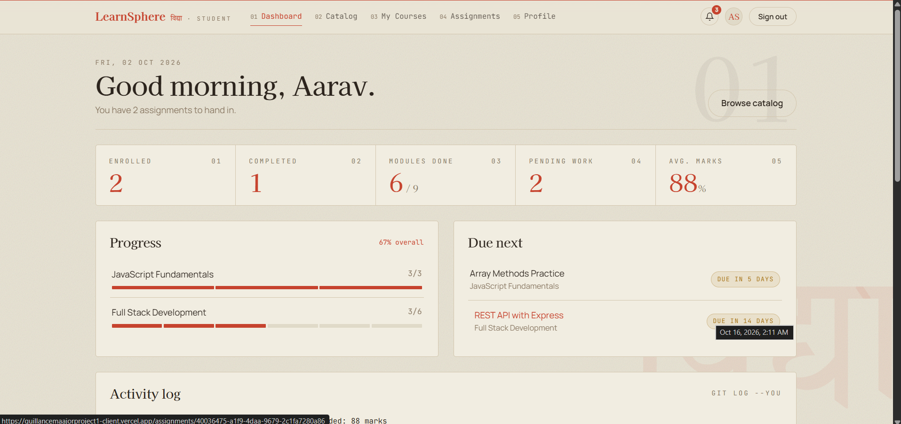
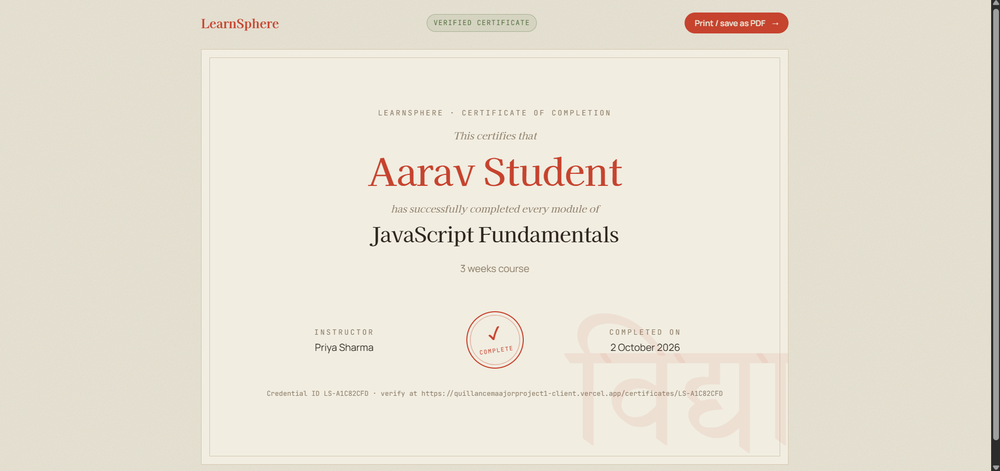
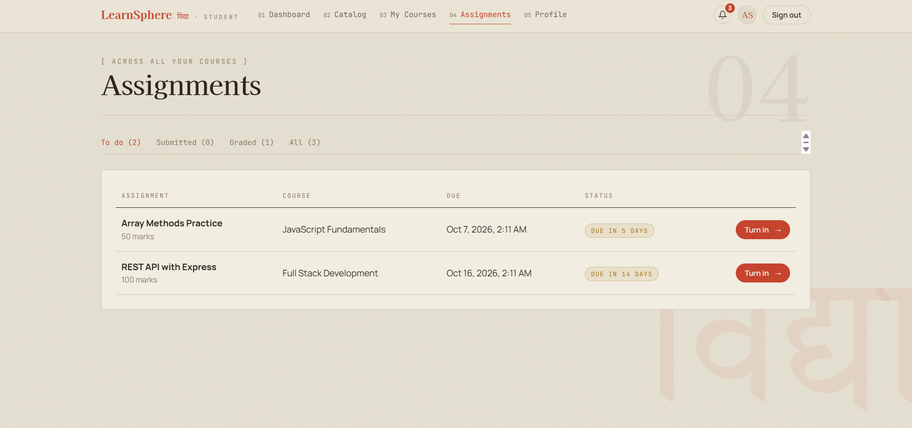
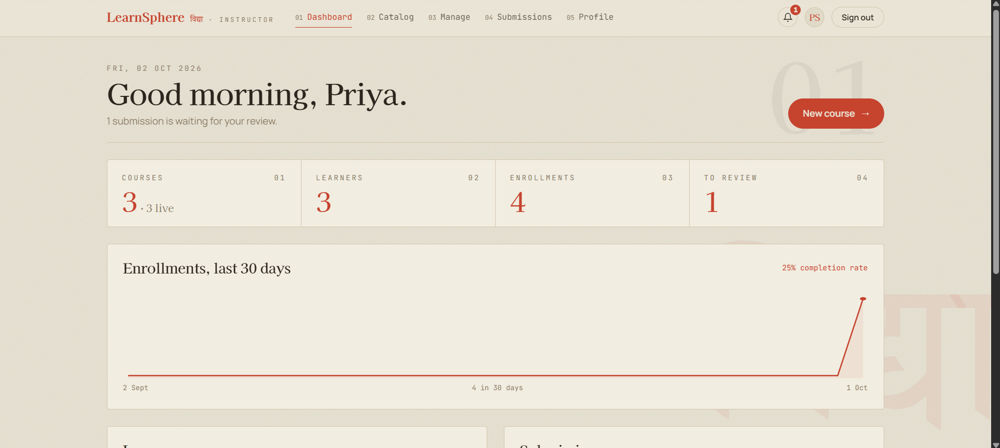
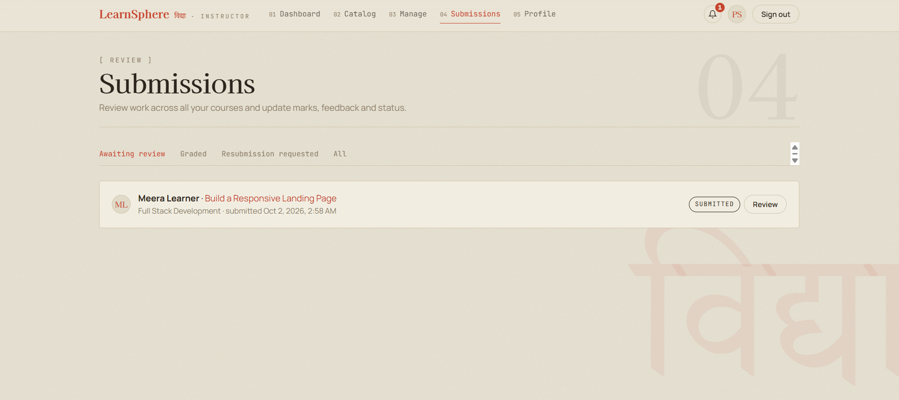

# LearnSphere

LearnSphere is a learning management system I built for my Full Stack Development major project at Quillance Infotech. Students enroll in courses, work through the modules, take quizzes, hand in assignments and keep track of where they are. Instructors create the courses and mark the work, and an admin looks after users and roles.

- Student: Abhyuday Saksena
- Live site: https://quillancemaajorproject1-client.vercel.app
- Code: https://github.com/abhyudaysaksena06/QuillanceMaajorProject_1
- Project report (PDF): [submission/LearnSphere_LMS_Documentation.pdf](submission/LearnSphere_LMS_Documentation.pdf)

## Why I built it this way

In most of my courses the material sat in a Drive folder, deadlines were posted in a WhatsApp group and marks came back in a spreadsheet. The idea was to put all of that in one place, with separate views for students and instructors.

## Tech stack

| Part | What I used |
|---|---|
| Frontend | React 18, Vite, React Router, plain CSS |
| Backend | Node.js and Express |
| Database | Supabase (PostgreSQL) |
| Login | Firebase Authentication (email/password and Google) |
| Hosting | Vercel for the frontend, Render for the backend |

## What it does

**Students** can
- sign up with email and password or with Google, and reset a forgotten password
- browse the catalog, filter by category and level, and enroll
- read each module (notes, an embedded video and links to extra material) and mark it done
- take the quiz at the end of a module; the module only counts as done once they pass
- hand in assignments as text, a link or a file (PDF, ZIP, DOCX or an image, up to 10 MB), and edit them until they are marked
- see their marks and the instructor's feedback, or redo the work if it was sent back
- ask questions in each course's discussion tab
- keep private notes for each course
- get a certificate when they finish a course, with a public page anyone can use to check it

**Instructors** can
- create, edit, publish and delete courses
- add modules, change their order and attach materials
- write quizzes and set a pass mark
- set assignments with a deadline and maximum marks
- go through submissions, give marks and feedback, or ask for a resubmission
- see each student's progress, download the gradebook as a CSV file and send announcements
- see charts of enrollments and submissions on their dashboard

**Admins** can do everything an instructor can on every course, and can also change user roles, deactivate accounts, move a course to another instructor and send announcements to everyone.

Everyone gets a notification bell for new assignments, marks, replies and certificates, and can upload a profile photo. A user who first signed in with Google can add a password from their profile, and the other way round, so both sign-in methods open the same account.

## How it fits together

```
React app (Vercel)  ──►  Firebase Auth   (sign-in, gives the app a token)
        │
        │  every request carries the Firebase token
        ▼
Express API (Render)  ──►  checks the token with the Firebase Admin SDK
        │                  checks the user's role and whether they own / are enrolled in the course
        ▼
Supabase (PostgreSQL + file storage)
```

The browser never talks to the database directly. Row Level Security is on for every table and there are no public policies, so only the server (which holds the service role key) can read or write data. All the permission checks happen in the Express routes.

Progress is not stored as a number. It is worked out from the modules a student has finished, so it stays correct when an instructor adds or removes modules.

## Database

Eleven tables: `users`, `courses`, `lessons` (the modules, including their quiz), `enrollments` (also holds the certificate ID), `lesson_progress`, `quiz_attempts`, `assignments`, `submissions`, `discussions`, `discussion_replies` and `notifications`. Uploaded files go into two Supabase Storage buckets, `submissions` (private) and `avatars` (public).

The SQL is in [`database/`](database/): `setup_all.sql` creates everything from scratch, and `ER-diagram.md` shows how the tables connect.

## Project folders

```
client/        React frontend (pages, components, styles)
server/        Express API (routes, auth middleware, helpers, demo seed script)
database/      SQL files and the ER diagram
docs/          API list, test checklist, local setup guide, demo video script
submission/    project report, screenshots and the final zip
```

## Running it locally

You need Node.js 18 or newer, a Firebase project and a Supabase project. The full walkthrough, including where to find every key, is in [docs/RUN_LOCALLY.md](docs/RUN_LOCALLY.md). In short:

1. Run `database/setup_all.sql` in the Supabase SQL editor.
2. Turn on Email/Password and Google sign-in in Firebase.
3. Copy `server/.env.example` to `server/.env` and `client/.env.example` to `client/.env`, and fill them in.
4. Then:

```bash
npm run setup       # installs everything
npm run seed:demo   # creates the demo accounts below
npm run dev         # API on port 5000, website on port 5173
```

## Demo accounts

All of them use the password `Demo@1234`.

| Role | Email |
|---|---|
| Student | student@learnsphere.demo |
| Student | student2@learnsphere.demo |
| Instructor | instructor@learnsphere.demo |
| Admin | admin@learnsphere.demo |

## Deployment

The backend runs on Render (root folder `server`, start command `npm start`) with the same variables as `server/.env`. The frontend runs on Vercel (root folder `client`, Vite preset) with the `VITE_` variables, where `VITE_API_URL` points at the Render URL. The Vercel domain also has to be added to `CLIENT_URL` on Render and to the authorised domains in Firebase.

## Screenshots

All 18 are in [`submission/Screenshots/`](submission/Screenshots/). A few of them:

| Home | Student dashboard | Certificate |
|---|---|---|
|  |  |  |
| **Assignments** | **Instructor dashboard** | **Submissions** |
|  |  |  |

## Testing

I tested the main flows by hand. The checklist I followed is in [docs/TESTING.md](docs/TESTING.md), and the API routes are listed in [docs/API.md](docs/API.md).

## What I would add next

Course ratings, live classes with attendance, and notifications that arrive instantly instead of being checked every minute.
