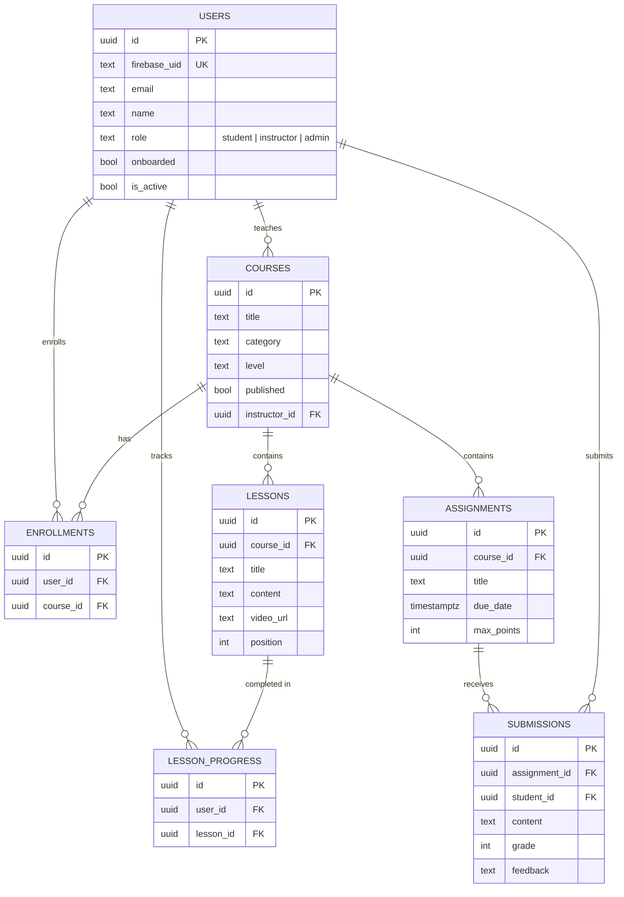

# Entity-Relationship Diagram

```mermaid
erDiagram
    USERS ||--o{ COURSES : "teaches"
    USERS ||--o{ ENROLLMENTS : "enrolls"
    COURSES ||--o{ ENROLLMENTS : "has"
    COURSES ||--o{ LESSONS : "contains"
    COURSES ||--o{ ASSIGNMENTS : "contains"
    USERS ||--o{ LESSON_PROGRESS : "tracks"
    LESSONS ||--o{ LESSON_PROGRESS : "completed in"
    ASSIGNMENTS ||--o{ SUBMISSIONS : "receives"
    USERS ||--o{ SUBMISSIONS : "submits"

    USERS { uuid id PK
      text firebase_uid UK
      text email
      text name
      text role "student | instructor | admin"
      bool onboarded
      bool is_active }
    COURSES { uuid id PK
      text title
      text category
      text level
      bool published
      uuid instructor_id FK }
    LESSONS { uuid id PK
      uuid course_id FK
      text title
      text content
      text video_url
      int position }
    ENROLLMENTS { uuid id PK
      uuid user_id FK
      uuid course_id FK }
    LESSON_PROGRESS { uuid id PK
      uuid user_id FK
      uuid lesson_id FK }
    ASSIGNMENTS { uuid id PK
      uuid course_id FK
      text title
      timestamptz due_date
      int max_points }
    SUBMISSIONS { uuid id PK
      uuid assignment_id FK
      uuid student_id FK
      text content
      int grade
      text feedback }
```
