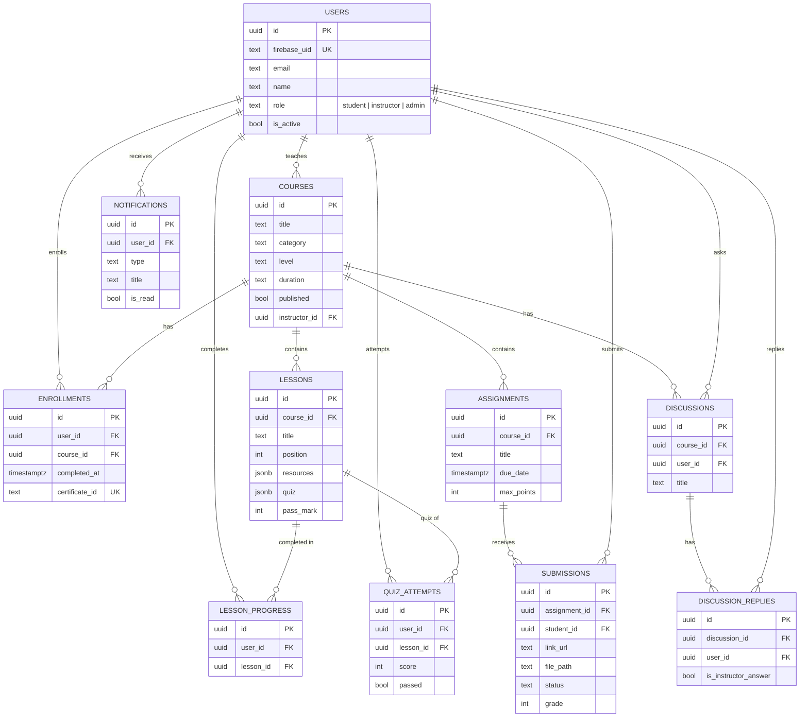

# Entity-Relationship Diagram

```mermaid
erDiagram
    USERS ||--o{ COURSES : "teaches"
    USERS ||--o{ ENROLLMENTS : "enrolls"
    COURSES ||--o{ ENROLLMENTS : "has"
    COURSES ||--o{ LESSONS : "contains"
    COURSES ||--o{ ASSIGNMENTS : "contains"
    COURSES ||--o{ DISCUSSIONS : "has"
    USERS ||--o{ LESSON_PROGRESS : "completes"
    LESSONS ||--o{ LESSON_PROGRESS : "completed in"
    USERS ||--o{ QUIZ_ATTEMPTS : "attempts"
    LESSONS ||--o{ QUIZ_ATTEMPTS : "quiz of"
    ASSIGNMENTS ||--o{ SUBMISSIONS : "receives"
    USERS ||--o{ SUBMISSIONS : "submits"
    DISCUSSIONS ||--o{ DISCUSSION_REPLIES : "has"
    USERS ||--o{ DISCUSSIONS : "asks"
    USERS ||--o{ DISCUSSION_REPLIES : "replies"
    USERS ||--o{ NOTIFICATIONS : "receives"

    USERS { uuid id PK
      text firebase_uid UK
      text email
      text name
      text role "student | instructor | admin"
      bool is_active }
    COURSES { uuid id PK
      text title
      text category
      text level
      text duration
      bool published
      uuid instructor_id FK }
    LESSONS { uuid id PK
      uuid course_id FK
      text title
      int position
      jsonb resources
      jsonb quiz
      int pass_mark }
    ENROLLMENTS { uuid id PK
      uuid user_id FK
      uuid course_id FK
      timestamptz completed_at
      text certificate_id UK }
    LESSON_PROGRESS { uuid id PK
      uuid user_id FK
      uuid lesson_id FK }
    QUIZ_ATTEMPTS { uuid id PK
      uuid user_id FK
      uuid lesson_id FK
      int score
      bool passed }
    ASSIGNMENTS { uuid id PK
      uuid course_id FK
      text title
      timestamptz due_date
      int max_points }
    SUBMISSIONS { uuid id PK
      uuid assignment_id FK
      uuid student_id FK
      text link_url
      text file_path
      text status
      int grade }
    DISCUSSIONS { uuid id PK
      uuid course_id FK
      uuid user_id FK
      text title }
    DISCUSSION_REPLIES { uuid id PK
      uuid discussion_id FK
      uuid user_id FK
      bool is_instructor_answer }
    NOTIFICATIONS { uuid id PK
      uuid user_id FK
      text type
      text title
      bool is_read }
```
